# 🍓 House Jam – Family Jam Shop Website

Live website: 

[](https://nic1mic.github.io/milestone1-house-jam/)


---

## 1. Project Overview

House Jam is a simple front-end website that serves a small family business that sells homemade jams. The website gives people a fast way to get to know the brand and allows them to check out the jams and reach out to place an order or inquire about them.

The site also allows customers to see what’s available — and how much it costs — without having to pop in to the store. The site is welcoming and simple, and works well on any device.


This project was developed as part of a milestone assessment to demonstrate:

- HTML5 & CSS3 skills
- UX design planning
- Responsive design
- Git & GitHub version control
- Deployment using GitHub Pages
- Professional documentation practices

---

## 2. User Experience (UX)

### 2.1 Project Goals

#### Business Goals
- Promote the House Jam brand online
- Present products clearly and attractively
- Allow customers to easily contact the business
- Build trust with a friendly family-business design

#### User Goals
- Understand what House Jam sells
- Browse jam products and prices easily
- Find contact information quickly
- Use the site comfortably on any device

---

### 2.2 User Stories


#### First-time visitor
As a user:
- I want to understand what House Jam is.
- I want to see what products are available.
- I want to know how to contact the business.

#### Returning visitor
As a user:
- I want to check prices quickly.
- I want to identify best-selling products.

#### Business owner
As a business owner:
- I want the site to look professional.
- I want customers to be able to contact me easily.

---

### 2.3 Design Choices

**Colour Scheme**
- Soft pinks and warm tones to reflect fruit and homemade products
- Light background for readability

**Typography**
- Clean sans-serif font for clarity

**Layout**
- Consistent navigation bar on all pages
- Hero section on each page
- Grid layout for products
- Two-column layout for contact page

**Animations**
- Subtle fade-up animation for hero text on page load

---


### 2.4 Wireframes

Wireframes were created before development to plan the layout and structure of each page. This helped ensure clear navigation, consistent design, and a user-friendly experience.

The following pages were planned using wireframes:

- Home page – hero section, featured products, call-to-action
- About page – business story and values
- Products page – 3x3 product grid layout
- Contact page – two-column layout with form and map


Wireframe tool used: [A link to Figma Mobile version Wireframing](https://www.figma.com/design/ChXtGokIT2IMErtP3RN3Pt/HouseJam?node-id=7-233&t=vqM8kK6oJ5qIvv5Q-1)

Wireframe tool used: [A link to Figma Tablet version Wireframing](https://www.figma.com/design/Ax1UXfph14qQ3yWaSCvfoK/House-Jam-Tablet?node-id=0-1&t=hGiHdoLvJOf83kkz-1)

Wireframe tool used: [A link to Figma Desktop version Wireframing](https://www.figma.com/design/ChXtGokIT2IMErtP3RN3Pt/HouseJam?node-id=0-1&t=vqM8kK6oJ5qIvv5Q-1)


---

## 3. Features

- Responsive navigation bar
- Hero section with background image
- Animated homepage text
- Featured products section
- Product grid with prices and buttons
- Best seller badge
- Contact form
- Google Maps integration
- Mobile responsive layout
- Click product images to show ingredient information

---

## 4. Technologies Used

- HTML5
- CSS3
- Git
- GitHub
- GitHub Pages

---

## 5. Folder Structure

```text
milestone1-house-jam/
│
├── images/
│   ├── final-product/
│   ├── wireframes/
│   └── testing/
├── css/
│   └── style.css
├── index.html
├── about.html
├── products.html
├── contact.html
└── README.md
```

---

## 6. Deployment

### 6.1 GitHub Pages Deployment Steps

1. Log into GitHub
2. Open the repository
3. Go to Settings
4. Click Pages
5. Select:
   - Branch: main
   - Folder: / (root)
6. Click Save
7. Wait for the site to deploy

Live URL:

[House Jam](https://nic1mic.github.io/milestone1-house-jam/)


---

### 6.2 Running Locally

To run the project locally:

```bash
git clone https://github.com/Nic1Mic/milestone1-house-jam.git
```


---

## 7. Testing

Testing was carried out continuously throughout development and again after deployment to ensure the website is functional, responsive, accessible, and free from major usability issues.

### Testing User Stories from User Experience (UX) Section


#### First-time Visitor – Understand the brand

**User Story:**  
_As a first-time visitor, I want to quickly understand what House Jam is._

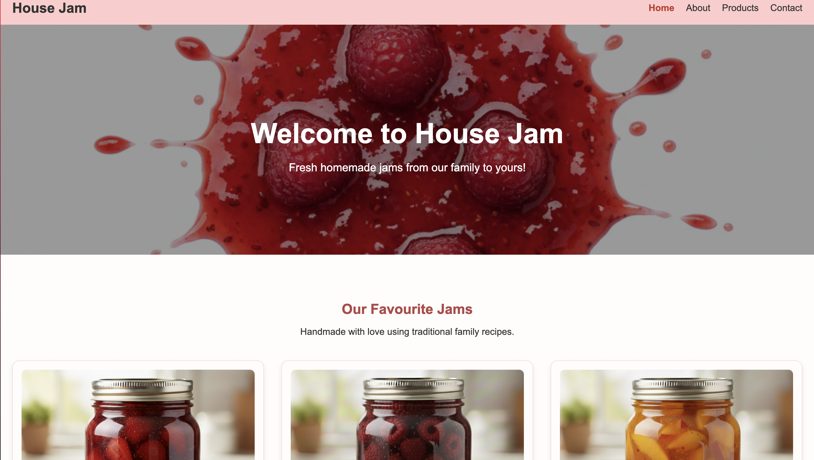

The homepage clearly shows the brand using a hero section, welcoming text, and featured products.

---

#### User – Browse products and prices

**User Story:**  
_As a user, I want to see what jam products are available and how much they cost._


The products page displays a clear grid layout showing product images, names, prices, and enquiry options.

---

#### User – View product details (ingredients)

**User Story:**  
_As a user, I want to see what ingredients are used in each product._

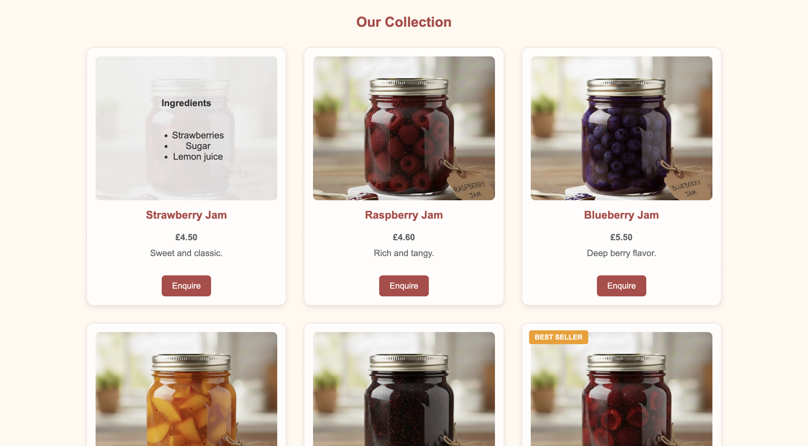

Ingredient information is revealed using a CSS-based image overlay interaction, allowing users to view details without leaving the page.

---

#### User – Contact the business

**User Story:**  
_As a user, I want to easily contact the business to make an enquiry._

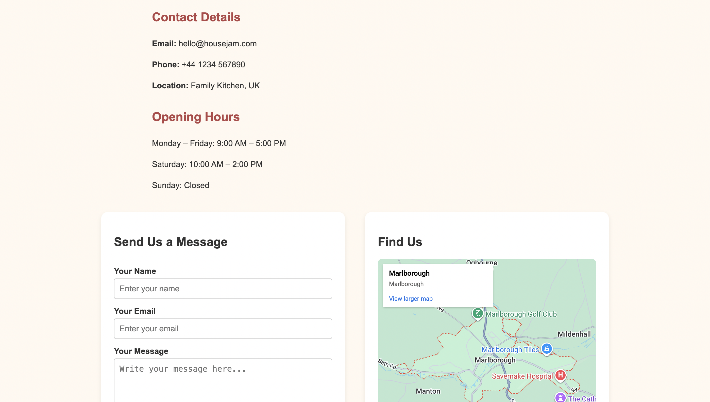

The contact page provides a contact form to help users reach the business easily.

---

#### Returning Visitor – Quick access to products and prices


**User Story:**  
_As a returning user, I want to quickly find products and prices._


The products page allows returning users to immediately view product names, prices, and enquiry buttons without unnecessary navigation.

---

#### Frequent User – Consistent navigation and layout


**User Story:**  
_As a frequent user, I want a consistent and familiar layout._


The consistent navigation bar and page structure across all pages ensures ease of use for frequent visitors.


### 7.1 Manual Testing

| Feature | Action | Expected Result | Outcome |
|--------|--------|----------------|----------|
| Navbar links | Click each link | Correct page opens | Pass |
| Contact form | Submit empty | Validation error shown | Pass |
| Contact form | Submit valid | Form submits | Pass |
| Product buttons | Click button | Button responds | Pass |
| Map | Load contact page | Map displays | Pass |
| Responsive layout | Resize screen | Layout adjusts | Pass |

---

### 7.2 Responsive Testing

Tested on:

- Desktop (1920px)
- Tablet (768px)
- Mobile (375px)

---

### 7.3 Browser Compatibility

Tested on:

- Google Chrome
- Mozilla Firefox
- Microsoft Edge

---

### 7.4 Validators

- HTML validated using W3C Validator  
- CSS validated using W3C CSS Validator  

Accessibility considerations included:

- Use of semantic HTML elements
- Sufficient color contrast for readability
- Responsive layout for different screen sizes
- Clear navigation structure


### HTML Validation

All HTML pages were tested using the W3C HTML Validator with no errors.

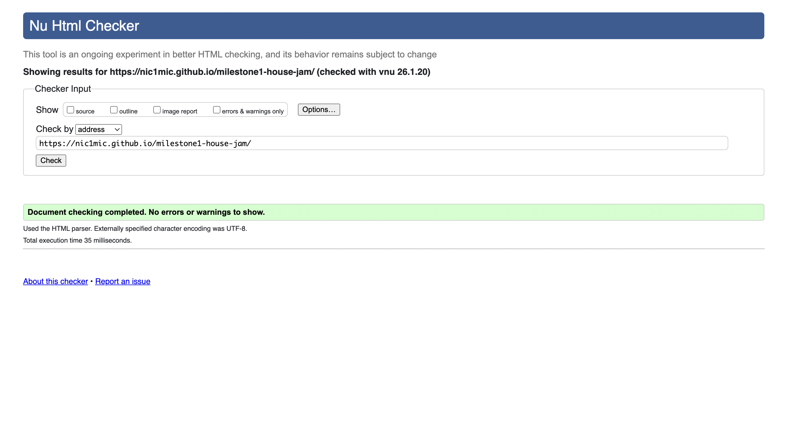
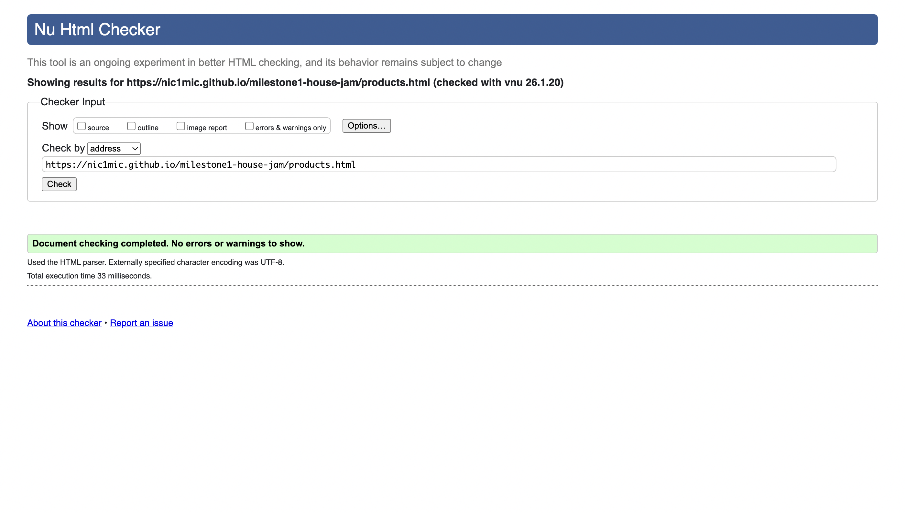

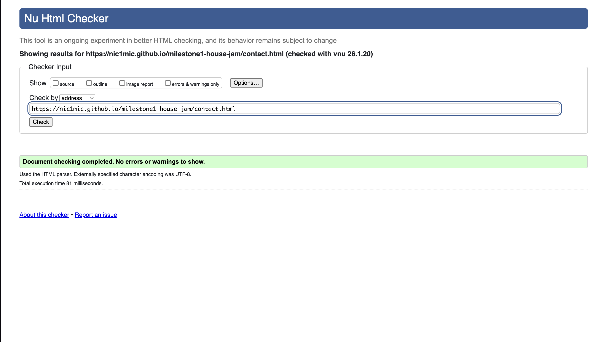

---

### CSS Validation

The CSS file was tested using the W3C CSS Validator (Jigsaw) with no errors.

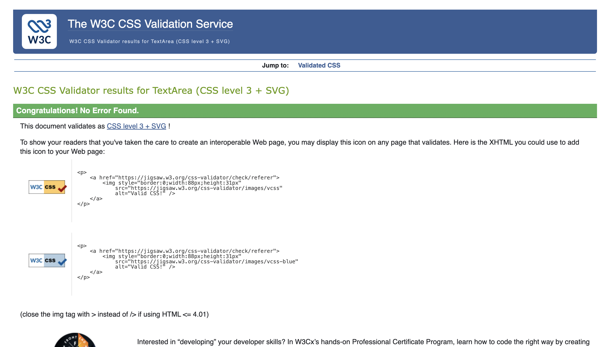

---

### 7.5 Lighthouse Testing

Google Chrome DevTools Lighthouse was used to audit the website for:

- Performance
- Accessibility
- Best Practices
- SEO

The tests were carried out on the deployed GitHub Pages version of the website.

#### Home Page Lighthouse Report

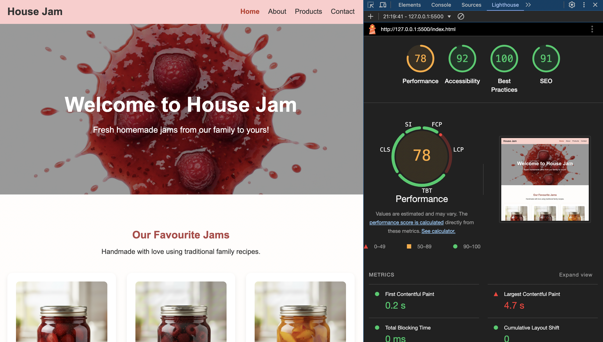

#### About Page Lighthouse Report

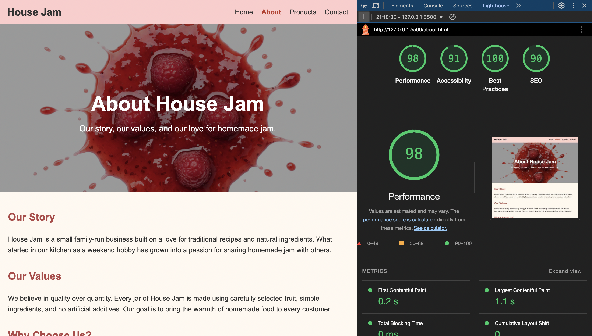

#### Products Page Lighthouse Report

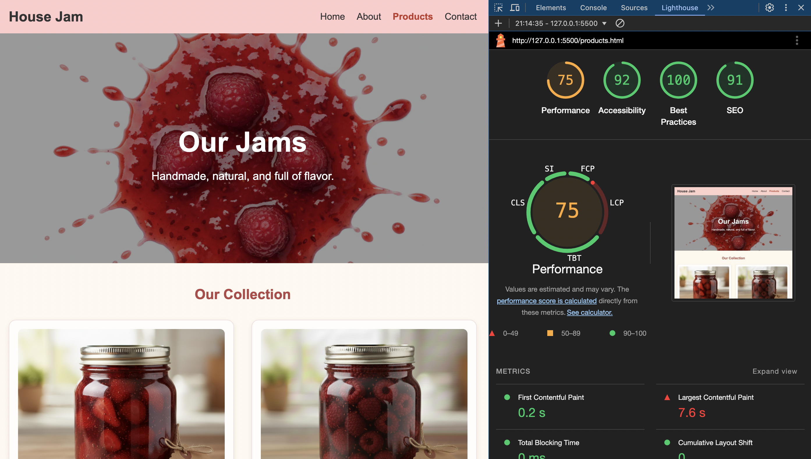

#### Contact Page Lighthouse Report

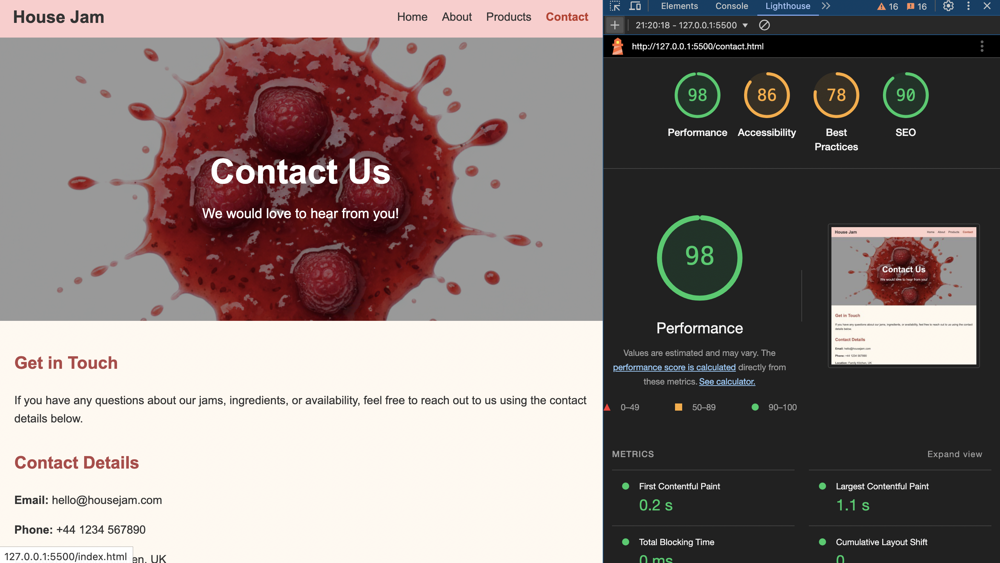

Overall, the website achieved high scores in accessibility and best practices, confirming good semantic HTML structure, color contrast, and responsive layout.


## 8. Bugs & Fixes

### Bug 1 – Grey line on left side

**Issue:** Layout issue caused by incorrect HTML tag `<setion>` instead of `<section>`.

**Fix:** Corrected the typo and wrapped content inside the `<main>` element.

---

### Bug 2 – Product image mismatch

**Issue:** Product images did not match product titles.

**Fix:** Corrected filenames and alt attributes.


## 9. Credits & Attribution

### Code

- Google Maps embed code generated from: https://developers.google.com/maps/documentation/embed/embedding-map

---

- Animated text and fade-in effects implemented following CSS fade-in tutorial: https://animate.style

---

- Product grid with prices and buttons the hover part: https://codepen.io/jorgesanes10/pen/QdMEXr

---

- Social media icons provided by Font Awesome  
  https://fontawesome.com

---

- Image overlay and reveal techniques (used for product ingredient):  https://www.w3schools.com/howto/howto_css_image_overlay.asp

### Images

All product images and the hero background image used in this project were generated using AI image generation tools for educational purposes.

The images were created specifically for this project to demonstrate layout, styling, and front-end design techniques.

Tools used:
- AI image generation platform (Gemeni)


## 10. Future Improvements

- Individual product pages  
- Shopping cart system  
- Backend for contact form  
- Product filtering  
- User reviews  

## 11. Author

Created by Nic1Mic – 2026


## 🌐 Live Demo

You can see the website live in your browser here:  

[🔗 View House Jam Website](https://nic1mic.github.io/milestone1-house-jam/)

